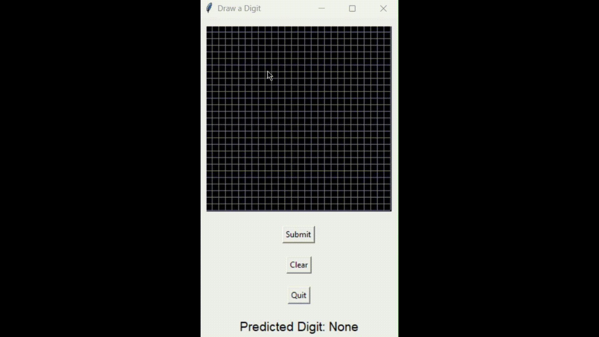

# MathNet: Handwritten Digit Recognition

[](LICENSE)
[](https://www.python.org/)

A high-accuracy neural network for MNIST digit classification, built entirely from scratch using only NumPy, Pandas, and Matplotlib. No deep learning frameworks required. Achieves 96% accuracy on the test set.

---

## Features

- Feed-forward neural network with 3 layers (784-128-64-10)
- Batch gradient descent and backpropagation
- Interactive drawing app for real-time digit prediction
- Image browser for viewing test results and predictions
- Model persistence for saving/loading trained networks
- Minimal dependencies, easy to understand and extend

## Demo



---

## Table of Contents
- [Installation](#installation)
- [Usage](#usage)
- [Model Architecture](#model-architecture)
- [Project Structure](#project-structure)
- [Results](#results)
- [Contributing](#contributing)
- [License](#license)
- [Acknowledgments](#acknowledgments)

---

## Installation

### Requirements
- Python 3.7+
- NumPy
- Pandas
- Matplotlib
- Pillow
- Tkinter (usually included with Python)

### Setup
```bash
git clone <repository-url>
cd Digit-Classification-From-Scratch
pip install numpy pandas matplotlib pillow
```

---

## Usage

### 1. Train a New Model
```bash
cd src
python neural_network.py
```
Trains the model on MNIST and saves it to `models/network.p`.

### 2. Evaluate the Model
```bash
cd src
python evaluate_model.py
```
Loads the trained model and opens an interactive browser for test predictions.

### 3. Interactive Drawing App
```bash
cd src
python drawing_app.py
```
Opens a drawing interface for real-time digit prediction.

---

## Model Architecture

- **Input Layer**: 784 neurons (28×28 pixels)
- **Hidden Layer 1**: 128 neurons, ReLU
- **Hidden Layer 2**: 64 neurons, ReLU
- **Output Layer**: 10 neurons, Softmax

**Hyperparameters:**
- Learning rate: 0.005
- Batch size: 64
- Epochs: 30
- Loss: Cross-entropy
- Optimizer: Batch gradient descent

---

## Project Structure
```
├── src/
│   ├── neural_network.py      # Neural network implementation and training
│   ├── evaluate_model.py      # Model evaluation and testing
│   ├── image_viewer.py        # Interactive image browser
│   └── drawing_app.py         # Drawing interface for predictions
├── assets/
│   ├── train.csv             # MNIST training data
│   ├── test.csv              # MNIST test data
│   └── Digit_Demo.mp4        # Demo video
├── models/
    └── network.p             # Saved trained model
```

---

## Results

- **Test Accuracy:** 96%
- **Training Time:** ~5-10 minutes
- **Model Size:** ~500KB (pickled)

---

## Implementation Details

- **Neural Network:** Manual forward/backward propagation, Xavier initialization, batch training
- **Data Processing:** Pixel normalization, one-hot encoding, 80/20 train/validation split
- **Visualization:** Real-time prediction, interactive navigation, drawing canvas

---

## Dataset

- Uses the MNIST dataset (CSV format) in `assets/`
- Or download from [Kaggle](https://www.kaggle.com/c/digit-recognizer/data) or [Yann LeCun's website](http://yann.lecun.com/exdb/mnist/)

---

## Troubleshooting

- **Tkinter not found:** Install with your OS package manager (e.g., `sudo apt-get install python3-tk`)
- **File not found:** Ensure `assets/train.csv` and `assets/test.csv` are present
- **Python version:** Tested on Python 3.10, but 3.7+ should work

---

## License

This project is licensed under the MIT License. See the [LICENSE](LICENSE) file for details.

---

## Acknowledgments

- MNIST dataset from Yann LeCun
- Inspiration from classic feedforward neural network designs
- Goat 3b1b
